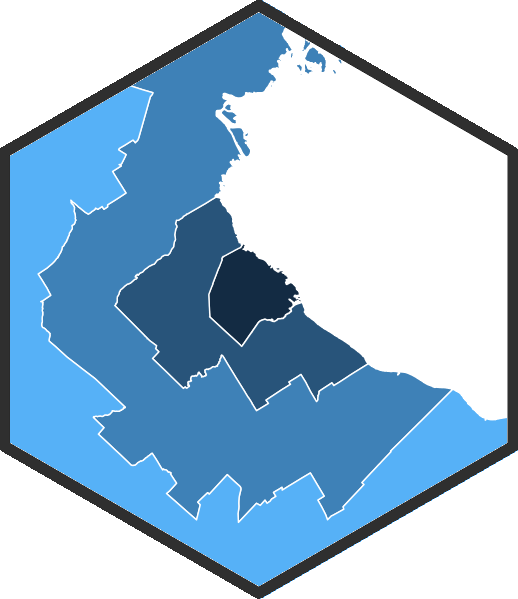

# RUMBA  

Un conjunto de herramientas para el análisis de la Región Urbana Metropolitana de Buenos Aires usando R.

Ya disponibles: 

- funciones de georeferenciamiento
- funciones de georeferenciamiento de manzanas en barrios vulnerables de la Ciudad de Buenos Aires

Por venir: 

- shapefiles con límites de radios censales, partidos, y "coronas" del conurbano
- datos de los censos 1991, 2001, 2010

Instalación
-----------
    install.packages("devtools")
    devtools::install_github("bitsandbricks/RUMBA")

Funciones de georeferenciamiento
--------------------------------

RUMBA incluye cuatro funciones que permiten obtener coordenadas precisas
(longitud y latitud) que corresponden a direcciones dentro de los
límites de la Región Urbana Metropolitana de Buenos Aires o bien de barrios vulnerables de la Ciudad de Buenos Aires.

Las funciones consultan la API del [Normalizador de
direcciones](http://servicios.usig.buenosaires.gob.ar/normalizar) y de [Déficit Habitacional](https://epok.buenosaires.gob.ar/deficithabitacional/) de la
[USIG](http://usig.buenosaires.gob.ar/). Ademas de las coordenadas, se
obtiene la dirección normalizada (escrita de forma inequívoca).

### USIG\_geocode

Georeferencia direcciones.

Uso general: `USIG_geocode(address)`, donde `address` es una dirección
dentro de los límites de la Región Urbana Metropolitana de Buenos Aires.

La dirección debe estar expresada como *“calle altura, partido”*,
*“calle altura, municipio”*, *“calle y calle, partido”*, o *“calle
altura, municipio”*. El partido o municipio son opcionales. De no ser
aclarados, y encontrarse múltiples direcciones que coincidan con la
búsqueda, se entregaran las coordenadas dentro de la Ciudad Autónoma de
Buenos Aires (si existieran), o en su defecto las del primer partido
-por orden alfabético- donde se haya encontrado la dirección.

En resumen: es mejor incluir partido o municipio en las direcciones a
georeferenciar.

#### Ejemplos

    library(RUMBA)

    USIG_geocode("9 de julio y belgrano")

    ##                address_normalised        lon        lat
    ## 1 9 DE JULIO AV. y BELGRANO, CABA -58.381226 -34.613090

Para asegurarse de recibir el resultado deseado, explicitar el municipio
o partido -sobre todo si es fuera de CABA:

    USIG_geocode("9 de julio y belgrano, temperley")

    ##                                                      address_normalised
    ## 1 Avenida 9 de Julio y Paso bajo nivel Manuel Belgrano, Lomas de Zamora
    ##         lon       lat
    ## 1 -58.39645 -34.77974

Se pueden georeferenciar varias direcciones a la vez:

    direcciones <- c("9 de Julio y Belgrano, Temperley", 
                     "Callao y Corrientes, CABA", 
                     "Anchorena 1210, La Lucila")

    USIG_geocode(direcciones)

    ##                                                      address_normalised
    ## 1 Avenida 9 de Julio y Paso bajo nivel Manuel Belgrano, Lomas de Zamora
    ## 2                                     CALLAO AV. y CORRIENTES AV., CABA
    ## 3                                   Tomás Anchorena 1210, Vicente López
    ##                 lon               lat
    ## 1       -58.3964491       -34.7797373
    ## 2        -58.392293        -34.604434
    ## 3 -58.4935336530612 -34.5009281857143

### mutate\_USIG\_geocode

Toma un dataframe que contiene una columna con direcciones, y en base a
ella agrega columnas con las longitudes y latitudes correspondientes.

Uso general: `mutate_USIG_geocode(data, address)`, donde

-   `data` es un dataframe con una columna que contiene direcciones
    dentro de los límites de la Región Urbana Metropolitana de Buenos
    Aires
-   `address` es el nombre de la columna que contiene las direcciones

La direcciones debe estar expresadas como se explica para `USIG_geocode`

#### Ejemplo

Creamos un dataframe que incluye direcciones:

    datos <- data.frame(lugar = c("A", "B", "C"),
                        valor = c(225000, 130500, 34000),
                        direccion = c("9 de Julio y Belgrano, Temperley",
                                       "Callao y Corrientes",
                                       "Anchorena 1210, La Lucila"))

    datos

    ##   lugar  valor                        direccion
    ## 1     A 225000 9 de Julio y Belgrano, Temperley
    ## 2     B 130500              Callao y Corrientes
    ## 3     C  34000        Anchorena 1210, La Lucila

Con `mutate_USIG_geocode`, agregamos columnas de lon y lat (obsérvese
qeu el nombre de la columna con las direcciones va entre comillas):

    mutate_USIG_geocode(datos, "direccion")

    ##   lugar  valor                        direccion
    ## 1     A 225000 9 de Julio y Belgrano, Temperley
    ## 2     B 130500              Callao y Corrientes
    ## 3     C  34000        Anchorena 1210, La Lucila
    ##                                                      address_normalised
    ## 1 Avenida 9 de Julio y Paso bajo nivel Manuel Belgrano, Lomas de Zamora
    ## 2                                     CALLAO AV. y CORRIENTES AV., CABA
    ## 3                                   Tomás Anchorena 1210, Vicente López
    ##                 lon               lat
    ## 1       -58.3964491       -34.7797373
    ## 2        -58.392293        -34.604434
    ## 3 -58.4935336530612 -34.5009281857143

### USIG\_geocode\_barrios\_vulnerables

Georeferencia direcciones en barrios vulnerables de la Ciuda de Buenos Aires.

Uso general: `USIG_geocode_barrios_vulnerables(address)`, donde `address` es una dirección 
dentro de los límites de un barrio vulnerable de la Ciudad de Buenos Aires.

La dirección debe estar expresada como *“barrio vulnerable, manzana + número manzana”*. 

#### Ejemplos

    library(RUMBA)

    USIG_geocode_barrios_vulnerables("Villa 31, manzana 8")

    ##              barrio_vuln        lon        lat
    ## Barrio 15 (Ciudad Oculta) -58.49024  -34.66918

Se pueden georeferenciar varias direcciones a la vez:

    direcciones <- c("Villa 31, manzana 2", 
                     "Rodrigo Bueno, manzana 2", 
                     "Villa 1-11-14, manzana 5")

    USIG_geocode_barrios_vulnerables(direcciones)

    ##                                                       barrio_vulnerable
    ## 1                             Barrio Padre Carlos Mugica (Villa 31 bis)
    ## 2                                            Asentamiento Rodrigo Bueno
    ## 3                                Barrio Padre Ricciardelli (ex 1-11-14)
    ##                 lon               lat
    ## 1         -58.37897         -34.58448
    ## 2         -58.35382         -34.61905
    ## 3         -58.43477         -34.64977

### mutate\_USIG\_geocode\_barrios\_vulnerables

Toma un dataframe que contiene una columna con direcciones, y en base a
ella agrega columnas con las longitudes y latitudes correspondientes y el nombre del barrio vulnerable oficial.

Uso general: `mutate_USIG_geocode(data, address)`, donde

-   `data` es un dataframe con una columna que contiene direcciones
    de un barrio vulnerable de la Ciudad de Buenos Aires.
-   `address` es el nombre de la columna que contiene las direcciones

La direcciones debe estar expresadas como se explica para `USIG_geocode_barrios_vulnerables`

#### Ejemplo

Creamos un dataframe que incluye direcciones:

    datos <- data.frame(lugar = c("A", "B", "C"),
                        valor = c(225000, 130500, 34000),
                        direccion = c("Villa 31, manzana 2",
                                      "Rodrigo Bueno, manzana 2",
                                       "Villa 1-11-14, manzana 5"))

    datos

    ##   lugar  valor                        direccion
    ## 1     A 225000 9 de Julio y Belgrano, Temperley
    ## 2     B 130500              Callao y Corrientes
    ## 3     C  34000        Anchorena 1210, La Lucila

Con `mutate_USIG_geocode_barrios_vulnerables`, agregamos columnas de lon y lat (obsérvese
que el nombre de la columna con las direcciones va entre comillas):

    mutate_USIG_geocode(datos, "direccion")

    ##   lugar  valor                        direccion
    ## 1     A 225000 Villa 31, manzana 2
    ## 2     B 130500              Rodrigo Bueno, manzana 2
    ## 3     C  34000        Villa 1-11-14, manzana 5
    ##                                                      address_normalised
    ## 1                             Barrio Padre Carlos Mugica (Villa 31 bis)
    ## 2                                            Asentamiento Rodrigo Bueno
    ## 3                                Barrio Padre Ricciardelli (ex 1-11-14)
    ##                 lon               lat
    ## 1         -58.37897         -34.58448
    ## 2         -58.35382         -34.61905
    ## 3         -58.43477         -34.64977
